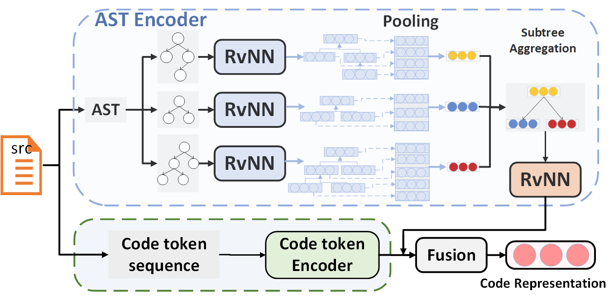

# CoCoAST: A Novel Neural Code Representation with Hierarchical Splitting and Reconstruction of Abstract Syntax Trees

## Environment

Create an environment and activate it:
```
conda create -n  CoCoAST python=3.6 ipykernel -y
conda activate CoCoAST
conda install pydot -y
conda install pyzmq -y
pip install git+https://github.com/casics/spiral.git
pip install pandas==1.0.5 gensim==3.5.0 scikit-learn==0.19.1 pycparser==2.18 javalang==0.11.0 tqdm networkx==2.3 nltk==3.6 psutil gin-config prettytable
conda install pytorch torchvision cudatoolkit=10.1 -c pytorch
pip install tqdm prettytable  transformers==4.12.5 gdown more-itertools tensorboardX  sklearn
pip install tree_sitter seaborn==0.11.2 fast-histogram
```
Install Java 1.8

Install pytorch according to your environment, see https://pytorch.org/ 
you can use `nvcc --version` to check the cuda version. 

## Model

CoCoAST(A Novel Neural Code Representation with Hierarchical Splitting and Reconstruction of Abstract Syntax Trees）hierarchically splits a large AST into a set of subtrees 
and learns the representation of the complete AST by aggregating its subtrees' representation learned using tree-based neural models.
The overall framework includes three major components:
an AST encoder, a code token encoder,and a multi-modality fusion module. Given an input method, the AST encoder captures the semantic and structural information of its AST. 
The code token encoder encodes the lexical information of the method. The fusion module merges the information from two modalities (AST and code) to obtain the final neural code representation.



## Code Search

###  Data Preparation 

#### Downloading and preprocessing codesearchnet java dataset
```
cd code_search/dataset
wget https://s3.amazonaws.com/code-search-net/CodeSearchNet/v2/java.zip
unzip java.zip
rm *.zip
python preprocess.py
```
it will generate `train.jsonl`,`valid.jsonl`,`test.jsonl` and `codebase.jsonl`

The statistic of dataset

|Train|Valid|Test|Codebase|
| :--------- | :------: | :----: | :----: |
| 164,923 | 5,183 | 10,955 | 40,347 |

#### Obtaining split asts

```
cd code_search/dataset
bash get_split_ast.sh 
% getting ast vocab
python get_flatten_ast_and_ast_vocab.py
```

### Train and Evaluation

```
cd code_search/
bash run.sh
```
### Result

The results are saved in [here](code_search/saved_models/csn_java/cocoast)

|Model | MRR |R@1 |R@5 | R@10|
| :--------- | :------: | :----: | :----: | :----: |
|NBow |0.170 |0.123 |0.258 |0.334|
|CNN |0.287 |0.201 |0.377 | 0.454 |
|BiRNN |0.305 |0.21 |0.392 |0.471|
|SelfAtt |0.403 |0.305 | 0.511 |0.591 |
|Transformer |0.420 |0.324 |0.532 |0.610 |
|codeastnn |0.438 |0.336 |0.554| 0.633|
|CoCoAST |**0.461** |**0.360** |**0.580** |**0.657** |

## Code Summarization

###  Data Preparation 

Download Processed the dataset by:

```
cd .code_summarization/Data/
bash get_data.sh
cd ../
```

or
run python `pipeline.sh` to generate preprocessed small data from scratch.
   
|Dataset|train|valid|test|
| :--------- | :------: | :----: | :----: |
| TL-CodeSum | 66,935   | 8,359  | 8,367  |
| Funcom     | 1,904,093 | 103,650  | 103,487|

More details about AST splitting implementation can refer to [Splitting](Splitting)

###  Training

You can download the trained model by:

```
bash get_trained_model.sh
```

The model is saved in `./code_summarization/output/DATASET_NAME/model.pth`.
DATASET_NAME is `TL_CodeSum` or `Funcom`.

You  can also train it from scratch.
`batch size `should be configured based on the GPU memory size by setting `-bs xx`
#### Train in Single GPU
```
cd code_summarization/source_code/
python casts.py  -cf_file "DATASET_NAME.json"  -ddp False
  ```  
for example

```
python casts.py  -cf_file "TL_CodeSum.json"  -ddp False
```  
#### Train in Multi-GPU

Take 4-GPUs for example:
```
cd code_summarization/source_code/
python -m torch.distributed.launch --nproc_per_node=4  --master_addr='localhost' --master_port=23456 casts.py  -cf_file "DATASET_NAME.json" 
```
note: you can find the output in `code_summarization/output/DATASET_NAME`. 

###  Testing 

Set `-only_test` is `True` for testing. 
The model is load from `code_summarization/output/tl_codesum/model.pth`
and the log file and predict result are saved in `code_summarization/output/tl_codesum/predict.json`

```
cd code_summarization/source_code/
python casts.py  -cf_file "DATASET_NAME.json"  -ddp False -only_test True
```    
for example

```
python casts.py  -cf_file "TL_CodeSum.json"  -ddp False  -only_test True
```
### Evaluation  
```
cd code_summarization/source_code/
python evaluation.py -dataset DATASET_NAME
```

for example
```
cd code_summarization/source_code/
python evaluation.py -dataset TL_CodeSum
```
    
### Human evaluation
    
Click [here](code_summarization/human-evaluation/README.md) to see the result of human evaluation


